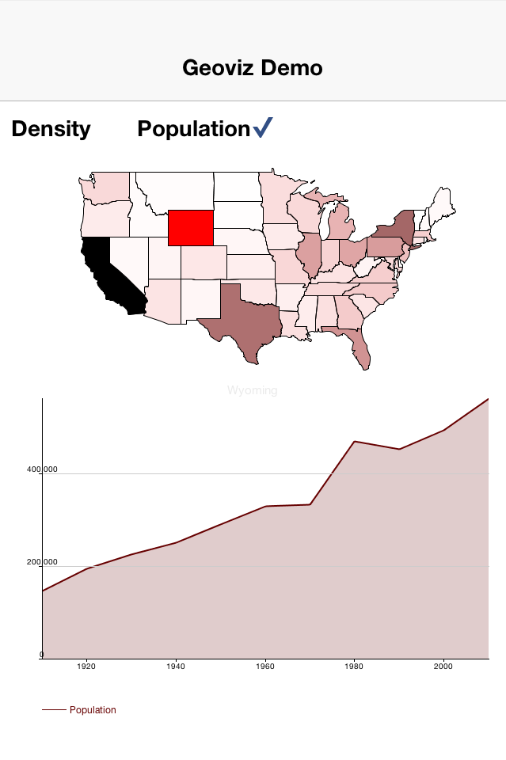

= Codename One GeoViz Library
:toc:
:source-highlighter: coderay
A Library to Load and Render GeoJSON data in Codename One

== Synopsis

This library provides support for loading GeoJSON data in a Codename One application.  It also provides a component to render the GeoJSON data.

== License 

GPL+Classpath Exception

== Installation

(The following instructions are for Netbeans.  Installation in Eclipse or IntelliJ projects should be similar).

1. Download the https://github.com/shannah/CN1GeoViz/releases[latest CN1GeoViz.cn1lib release], and copy it to your project's "lib" directory.
2. Right click your project in the project explorer and select "Refresh Libs".

== Getting Started

[source,java]
----
//Load a GeoJSON file
GeoJSONLoader loader = new GeoJSONLoader();
FeatureCollection coll = loader.loadJSON(
        Display.getInstance().getResourceAsStream(null, "/us-states.json"), 
        "UTF-8"
);

// Create a GeoVizComponent to display the geo data
GeoVizComponent comp = new GeoVizComponent(coll);

----

== Documentation

* https://rawgit.com/shannah/CN1GeoViz/master/dist/javadoc/index.html[JavaDocs]

== Demo

See the https://github.com/shannah/GeoVizDemo[GeoVis Demo App] in the Codename One SVN repository.

